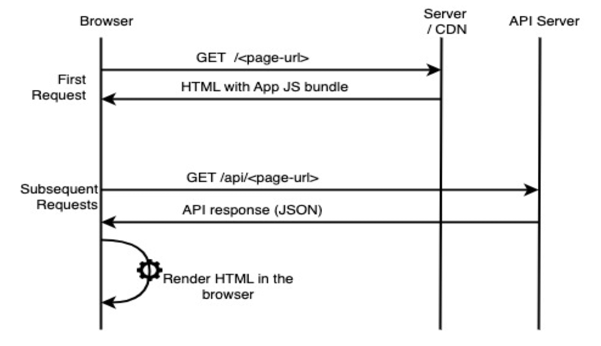
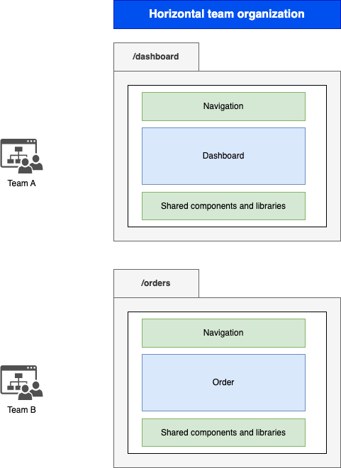
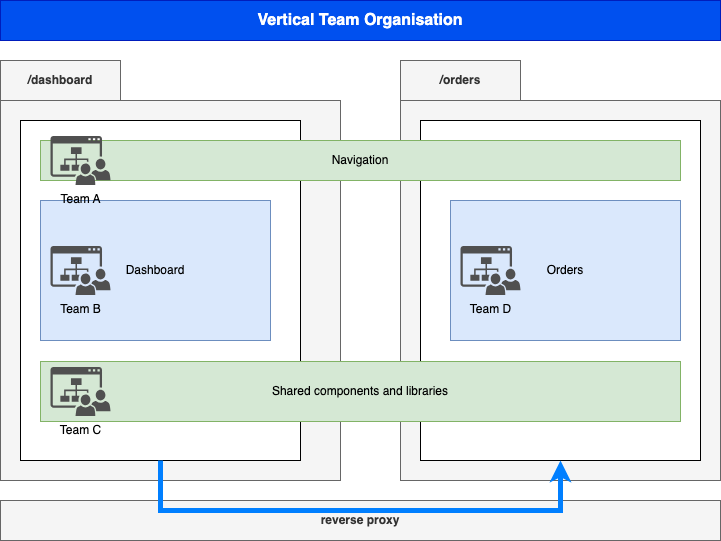

## The Frontend Odyssey: From unitary scripting to module federation

*Author:* _Achraf soltani_

## Introduction

Javascript started quite timidly, modest and small ^(1)^. It's main purpose was adding interactivity to web pages. It is worth mentioning that there were, back in the days, other technologies aiming for the same end, such as Java applets, VB script and ActiveX.

In the web 1.0 era, JavaScript was relying on the engine designed by *Brendan Eich* in 1995 for the Netscape Browser, which evolved into SpiderMonkey, Firefox's JavaScript engine still used today by the latter. But there was on the other hand, another ambitious project called *V8*, released by Google in 2008 as part of the Chromium project ^(2)^.

The V8 innovation lead directly to the exaltation of JavaScript to the server side, allowing JavaScript execution outside a browser (There was technically an ealier attempt with the NETSCAPE’S Live Wire stack which didn't come to full fruition a decade earlier ^(3)^), with fully fledged frameworks such as Express.js and more recent Next.js.

The history of JavaScript (https://www.youtube.com/watch?v=qKJP93dWn40[video]) by *Brendan Eich*, the designer of the language himself ^(4)^.

### A bit of history

As the Spanish philosopher George Santayana said: "Those who don't know history are doomed to repeat it". And in order for us to grasp the current state of the art, we need to delve into it's roots and have a look at every chapter of its evolutionary scale.

[quote,Michael Thomas,Handbook of Research on Web 2.0 and Second Language Learning (2008) (p. 20)]
Web 1.0 refers to the original, information-oriented version of the World Wide Web. Created by Tim Berners-Lee in 1989/1990, it consisted of largely static webpages developed by a small number of authors for consumption by a large audience.^(5)^

The following diagram illustrates the high level functioning of the Web in its infancy.

image::images/paper0-mfe.drawio.png[]

It is quite apparent that the Web 1.0 paradigm cannot constitute a sustainable model for World Wide Web, while users needed more and more, while being able to also share content. The same book follows on by describing the Web 2.0 as the social web:

[quote,Michael Thomas,Handbook of Research on Web 2.0 and Second Language Learning (2008) (p. 21)]
Web 2.0  technologies, from blogs and wikis through social  networking sites and folksonomies to podcasting  and virtual worlds, are all about communicative  networking. Such networking is likely to become  increasingly important as a digital native ethos  takes over from a digital immigrant one (Prensky,  2001), as more technologies become available to  those with little specialist expertise in IT, and as  today’s technologies converge to form ever more  versatile hybrids.

The barrier between classical heavy client applications and web applications shattered over time.

### State of the art

The shrinking barriers between heavy clients and web apps leaves a rift that sets free the new hybrid approach, in which the interaction with the user is performed by dynamically rewriting the application state with data from the server. The new paradigm thus signs the emancipation of Single Page Applications, or SPAs as most of us know them today.

"Better late than never" was the motto, giving rise to the frontend monolith with all of its "glory", mimicking to a great extent, the backend modular model (modules, components, services, data binding, routing, etc). A lot of frameworks then loomed out of the dark age of spaghetti scripts: AngularJS, Ember.js, Knockout.js, Meteor, ....

### Problem motivation

A great deal of evaluations (AKA pros and cons) on the internet, dealing with the subject of SPAs would, more often than not, deal with utility and the user experience aspects such as (SEO, traffic metrics, navigating back and forth, ...), which we will not delve into. Rather, a more appealing perspective to the present context will be laid down:

#### Performance

Transposing the heavy client to the web comes at a cost: the initial loading time of all the JS that makes the app up take a significant amount of time, in conjunction with the processing cost of running both the browser and the JS engine threads. Needless to point the finger at the latter for the extensive memory consumption and leaks.

This might be not true for small to medium-sized apps, but it strongly holds for bigger, complex applications.

#### Complexity and the cost of maintainability

As the holy SPA monolith grows in size to perform its miracles, so does complexity and the cost of maintainability. The SPA's "One ring to rule them all" maxim can only hold to a certain extent, for evolution is the essence of existence.

While a monolith in both, frontend and backend examinations, still usually works out to be an efficient as well as productive solution, and a big share of projects would probably benefit more from the traditional paradigm, a modern approach lurks beyond its climax.

## The Micro (r)evolution

"Better late than never" strikes once more. After its war for independence from the backend hegemony, and the establishment of the SPA's banana republic (module exports), it was time to think outside the cargo box (slightly altered in order to qualify as a Rust joke).

Jokes aside, the "Need For Speed&#8482;", and efficiency, requires further separation of concerns, but this time, at a higher level than just conventional modularity and SOLID principles^(6)^.

The success and the great adoption of the microservices architectural pattern heavily influenced the trends in the frontend sphere. As everything becomes "micro", the idea of micro-frontends becomes appealing, and even seductive. What if individual segments of a web application could be developed and deployed independently, without compromising the overall system's availability ? After all, a micro-frontend sounds as promising as microservices...

The Web Components Consortium held a meeting, and the majority said it's word, and voted for a federal republic, and a new constitution, with (De)composition as a first amendment.

### Challenges

So instead of building the frontend from a single codebase, and usually using a single framework, decomposing the application would in theory imply that each component is a standalone application, with its own dependencies, build cycle and deployment pipeline.

In order to achieve this ordeal, a number of approaches have been designed. Amongst the different implementations, let us cite:

### iFrames

[source,html]
----
<!DOCTYPE html>
<html>
    <head>
        <title>iFrames MFE</title>
        <link rel="stylesheet" href="style.css" />
    </head>
<body>

<iframe src="./dashboard/index.html" id="dashboard"></iframe>
<iframe src="./orders/index.html" id="orders"></iframe>

</body>
</html>
----

[source,javascript]
----
// app.js

window.addEventListener(
  "message",
  (event) => {
    document
    .querySelectorAll("iframe")
    .forEach(iframe => iframe.contentWindow.postMessage(event.data, "*"));
  },
  false,
);
----

### Webpack Module Federation

[source,javascript]
----
// app-shell/webpack.config.js

const ModuleFederationPlugin = require("webpack/lib/container/ModuleFederationPlugin");
const dependencies = require("./package.json").dependencies;

module.exports = {
  entry: "./src/index.js",
  mode: "development",
  output: {
    path: path.resolve(__dirname, "dist"),
    filename: "main.js",
  },
  devServer: {
    port: 3004,
    liveReload: true,
    historyApiFallback: true,
  },
  module: {
    rules: [
      {
        test: /\.(js|jsx)$/,
        exclude: /node_modules/,
        use: {
          loader: "babel-loader",
        },
      },
      {
        test: /\.scss$/,
        use: [MiniCssExtractPlugin.loader, "css-loader", "sass-loader"],
      },
    ],
  },
  name: "shell",
  plugins: [
    new HtmlWebpackPlugin({
      template: "./public/index.html",
      filename: "index.html",
    }),
    new MiniCssExtractPlugin(),
    new ModuleFederationPlugin({
      name: "shell",
      filename: "remoteEntry.js",
      remotes: {
          Nav: "Navigation@http://localhost:3001/remoteEntry.js", // mfe 1
          Sidebar: "Sidebar@http://localhost:3002/remoteEntry.js", // mfe 2
          Dashboard: "Dashboard@http://localhost:3003/remoteEntry.js" // mfe 3
      },
      exposes: {},
      shared: {
        "react": {
          singleton: true,
          requiredVersion: dependencies.react
        },
        "react-dom": {
          singleton: true,
          requiredVersion: dependencies["react-dom"]
        },
        "@mui/material": {
          singleton: true,
          requiredVersion: dependencies["@mui/material"]
        },
        "@mui/icons-material": {
          singleton: true,
          requiredVersion: dependencies["@mui/icons-material"]
        },
      }
    })
  ],
};
----

### Podium

[source,javascript]
----
// Podlet.js
import express from 'express';
import Podlet from '@podium/podlet';

const app = express();

const podlet = new Podlet({
    name: 'myPodlet',
    version: '1.0.0',
    pathname: '/',
    content: '/',
    fallback: '/fallback',
    development: true,
});

app.use(podlet.middleware());

app.get(podlet.content(), (req, res) => {
    res.status(200).podiumSend(`
        

            This is the podlet's HTML content
        

    `);
});

app.get(podlet.manifest(), (req, res) => {
    res.status(200).send(podlet);
});

app.listen(7100);
----

[source,javascript]
----
// Layout.js
import express from 'express';
import Layout from '@podium/layout';

const layout = new Layout({
    name: 'myLayout',
    pathname: '/',
});
const podlet = layout.client.register({
    name: 'myPodlet',
    uri: 'http://localhost:7100/manifest.json',
});

const app = express();
app.use(layout.middleware());

app.get('/', async (req, res) => {
    const content = await podlet.fetch();
    res.send(`
        <html><body>${content}</body></html>
    `);
});

app.listen(7000);
----

Each of the previous approaches share the same set of concerns; beyond the assembly of various HTML blocks, they all have a different answers to questions related so scripting scopes, assets, styles, routing and inter-mfe communication.

While Web Components for instance, rely on the shadow DOM for style isolation, or a Webpack/React composed micro-frontend implementing a shared state using Redux, an iFrame implementation might require more hands-on techniques to allow cross-origin communications such as invoking postMethod() on the Window object ^(7)^.

In contrast to microservices, we can clearly spot the increased complexity that comes pre-bundled with micro-frontends, one of them being unable to spell the word without a hyphen, the others are as follows:

- The payload size
- Governance complexity
- Performance and security
- Team Productivity and organization

We need to put a great deal of emphasis on the productivity variable in the micro-frontend equation, since its raison d'être are flexibility, isolation of failure and shorter TTMs. The following graph illustrates the tight relationship between complexity and team productivity when using either SPAs or micro-frontends.

image::images/paper0-mfe-vs-monolith.drawio.png[]

For better or worse, the frontend is bound to the client's browser, runtime, and hardware. A well-designed solution thus requires prudent decision-making and careful considerations.

### Architectural approaches

We can approach micro-frontends in diverse ways, not that there are countless ways to implement them, but prudence is of essence in regard to the technical implications. Since we are talking architecture, I believe that patterns are a good starting point:

###### The Multi-SPA pattern

A simple way to approach the micro-frontend paradigm, is to think of them as a swarm of SPAs linking to each other, with a set of shared components and libraries. We can warp the whole system behind a reverse proxy thereafter, in order to put routing in place that simulates the behavior of a traditional monolith.

image::images/multi-spa.png[]

In the previous diagram, two independent SPAs respond to their respective routes, while sharing for instance, a navigation component, and a UI library. This is probably the simplest approach that can be adopted by teams trying to embrace the new paradigm.

The following pattern is slightly more complex, and involves as we will discover further in the article, the concept of composition.

###### The Micro-Apps pattern

The micro-apps pattern, as the diagram illustrates, is more "micro" than the multi-SPA pattern, in the sens that each component is a truly independent application that is developed, built and deployed separately.

image::images/micro-apps.png[]

In this case, a central entity described as an App Shell is loaded first, and from that point onwards, it handles loading other components, routing and lifecycle. A central security management and state management systems can be implemented within the shell.

Each of the micro-apps is running on its own infrastructure, this allows on one hand, the App shell to selectively compose the interfaces in response to user interaction, and on the other, holding the promise of technology independence, failure isolation, and flexibility.

This simply means that, for instance, the orders team can make modifications to their components, build and deploy it, without impacting the whole system. In other words, the application would run just fine, minus the orders components if it's being rebooted or even in teh case of failure.

As described previously, a key characteristic of micro-frontends is context isolation and potentially technological freedom (which is the ability to write micro-frontends in various frameworks, in the same fashion of microservices, although the circumstances are quite constraining the case of micro-frontends, as everything runs on the same instance of an engine running inside one browser). This is where the choice of the composition strategy can be decisive.

#### Deployment strategies and Composition

There are currently two strategies to compose micro-frontends, the first is client side composition, which (lazy)loads the components from a previously parsed App Shell:

image::images/csr.png[]

A leading framework in client-side composition is Webpack, with the concept of Module Federation^(8)^.

This approach can be qualified as truly independent and isolated, however, caution must be exercised in regard to performance, especially when using different frameworks for each fragment, as the response time and bundle size grow.

The second strategy, as you might have inferred, is server-side composition, which tries to restrain the performance loss in the context of client-side composition.

image::images/ssc.png[]

A very promising framework for server-side composition is Podium^(8)^, which relies on express.js to serve what it describes as a Podlet. A podlet is just a metonym for fragment.

The SSR strategy simply offloads the burden of composition off of the frontend's shoulders, and calls upon the services of the backend once again. By composing the application on the server, we manage to optimize the loading time on the client, but it comes at the cost of a server side architecture and infrastructure implications, such as scalability, reliability and availability.

#### Domain decomposition and DDD

[quote,Aristotle]
Excellence is never an accident. It is always the result of high intention, sincere effort, and intelligent execution; it represents the wise choice of many alternatives - choice, not chance, determines your destiny.

Indeed, since Domain-Driver Design was the philosophy that inspired the motivation behind microservices, it can accomplish the same for Micro-frontends. We can therefore think of the proper team organization to follow suit.

The first team structure is horizontal, which implies that each team is responsible for single domain, as illustrated in the following diagram:

According to this organization, each team focuses on a single domain, while intrinsically contributing to the development of shared components and libraries.

The vertical team organization on the other hand, focuses the team's energy on a single component, thus enforcing domain decomposition, team and technology independence:

## Conclusion

This section of the article is supposed to be a summary, but truth be told, there are a lot of other subjects left unspoken of, such as security concerns, governance and change management.

We can however, recall the benefits of micro-frontends if the underlying philosophy is properly adopted and the technical aspects, adequately implemented :

- Scalability
- Failure isolation
- Independent development, builds and deployments
- Promoting DDD, automation and DevOps culture.

It goes without saying that one needs to exercise the utmost vigilance when dealing with micro-frontends, and more specifically:

- The complexity cost of implementing, deploying and managing micro-frontends
- Performance and security challenges (XSS, CSRF)
- Code duplication and redundancy (Multi-SPA pattern for example)
- Cross-Team coordination

Sources

(1): https://developer.mozilla.org/en-US/docs/Web/JavaScript/Guide/Modules

(2): https://en.wikipedia.org/wiki/V8_(JavaScript_engine)

(3): https://www.chicagotribune.com/1997/07/18/netscapes-live-wire/

(4): https://www.youtube.com/watch?v=qKJP93dWn40

(5): https://www.igi-global.com/book/handbook-research-web-second-language/517

(6): https://en.wikipedia.org/wiki/SOLID

(7): https://developer.mozilla.org/en-US/docs/Web/API/Window/postMessage

(8): https://webpack.js.org/concepts/module-federation/