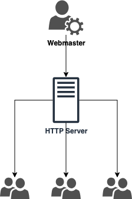
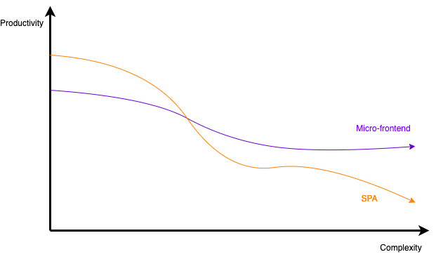
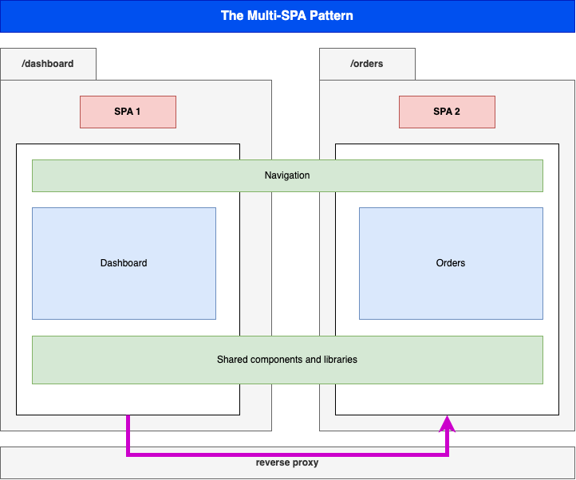
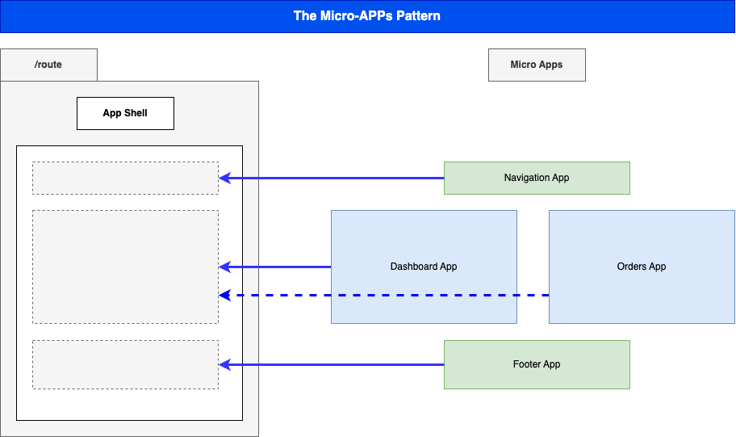
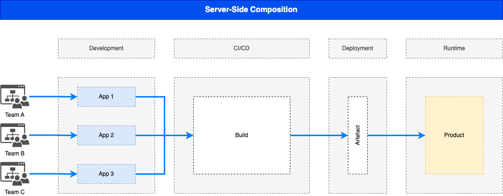
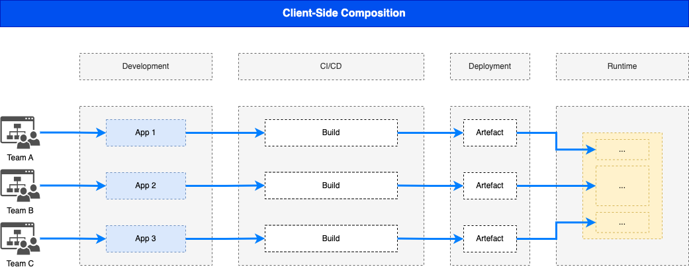

## The Frontend Odyssey: From unitary scripting to module federation

*Author:* _Achraf soltani_

## Abstract

## Introduction

Javascript started quite timidly, modest and small ^(1)^. It's main purpose was adding interactivity to web pages. It is worth mentioning that there were, back in the days, other technologies aiming for the same end, such as Java applets, VB script and ActiveX.

In the web 1.0 era, JavaScript was relying on the engine designed by *Brendan Eich* in 1995 for the Netscape Browser, which evolved into SpiderMonkey, Firefox's JavaScript engine still used today by the latter. But there was on the other hand, another ambitious project called *V8*, released by Google in 2008 as part of the Chromium project ^(2)^.

The V8 innovation lead directly to the exaltation of JavaScript to the server side, allowing JavaScript execution outside a browser (There was technically an ealier attempt with the NETSCAPE’S Live Wire stack which didn't come to full fruition a decade earlier ^(3)^), with fully fledged frameworks such as Express.js and more recent Next.js.

The history of JavaScript (https://www.youtube.com/watch?v=qKJP93dWn40[video]) by *Brendan Eich*, the designer of the language himself ^(4)^.

### A bit of history

As the Spanish philosopher George Santayana said: "Those who don't know history are doomed to repeat it". And in order for us to grasp the current state of the art, we need to delve into it's roots and have a look at every chapter of its evolutionary scale.

[quote,Michael Thomas,Handbook of Research on Web 2.0 and Second Language Learning (2008) (p. 20)]
Web 1.0 refers to the original, information-oriented version of the World Wide Web. Created by Tim Berners-Lee in 1989/1990, it consisted of largely static webpages developed by a small number of authors for consumption by a large audience.^(5)^

The following diagram illustrates the high level functioning of the Web in its infancy.

It is quite apparent that the Web 1.0 paradigm cannot constitute a sustainable model for World Wide Web, while users needed more and more, while being able to also share content. The same book follows on by describing the Web 2.0 as the social web:

[quote,Michael Thomas,Handbook of Research on Web 2.0 and Second Language Learning (2008) (p. 21)]
Web 2.0  technologies, from blogs and wikis through social  networking sites and folksonomies to podcasting  and virtual worlds, are all about communicative  networking. Such networking is likely to become  increasingly important as a digital native ethos  takes over from a digital immigrant one (Prensky,  2001), as more technologies become available to  those with little specialist expertise in IT, and as  today’s technologies converge to form ever more  versatile hybrids.

The barrier between classical heavy client applications and web applications shattered over time.

### State of the art

The shrinking barriers between heavy clients and web apps leaves a rift that sets free the new hybrid approach, in which the interaction with the user is performed by dynamically rewriting the application state with data from the server. The new paradigm thus signs the emancipation of Single Page Applications, or SPAs as most of us know them today.

"Better late than never" was the motto, giving rise to the frontend monolith with all of its "glory", mimicking to a great extent, the backend modular model (modules, components, services, data binding, routing, etc). A lot of frameworks then loomed out of the dark age of spaghetti scripts: AngularJS, Ember.js, Knockout.js, Meteor, ....

### Problem motivation

A great deal of evaluations (AKA pros and cons) on the internet, dealing with the subject of SPAs would, more often than not, deal with utility and the user experience aspects such as (SEO, traffic metrics, navigating back and forth, ...), which we will not delve into. Rather, a more appealing perspective to the present context will be laid down:

#### Performance

Transposing the heavy client to the web comes at a cost: the initial loading time of all the JS that makes the app up take a significant amount of time, in conjunction with the processing cost of running both the browser and the JS engine threads. Needless to point the finger at the latter for the extensive memory consumption and leaks.

This might be not true for small to medium-sized apps, but it strongly holds for bigger, complex applications.

#### Complexity and the cost of maintainability

As the holy SPA monolith grows in size to perform its miracles, so does complexity and the cost of maintainability. The SPA's "One ring to rule them all" maxim can only hold to a certain extent, for evolution is the essence of existence.

While a monolith in both, frontend and backend examinations, still usually works out to be an efficient as well as productive solution, and a big share of projects would probably benefit more from the traditional paradigm, a modern approach lurks beyond its climax.

## The Micro (r)evolution

"Better late than never" strikes once more. After its war for independence from the backend hegemony, and the establishment of the SPA's banana republic (module exports), it was time to think outside the cargo box (slightly altered in order to qualify as a Rust joke).

Jokes aside, the "Need For Speed&#8482;", and efficiency, requires further separation of concerns, but this time, at a higher level than just conventional modularity and SOLID principles^(6)^.

The success and the great adoption of the microservices architectural pattern heavily influenced the trends in the frontend sphere. As everything becomes "micro", the idea of micro-frontends becomes appealing, and even seductive. What if individual segments of a web application could be developed and deployed independently, without compromising the overall system's availability ? After all, a micro-frontend sounds as promising as microservices...

The Web Components Consortium held a meeting, and the majority said it's word, and voted for a federal republic, and a new constitution, with (De)composition as a first amendment.

### Challenges

Performance

So instead of building the frontend from a single codebase, and usually using a single framework, decomposing the application would in theory imply that each component is a standalone application, with its own dependencies, build cycle and deployment pipeline.

In order to achieve this ordeal, a number of approaches have been designed. Amongst the different implementations, let us cite:

- The old good iFrames
- Module Federation
- Web Components

Each of the previous approaches share the same set of concerns; beyond the assembly of various HTML blocks, they all have a different answers to questions related so scripting scopes, assets, styles, routing and inter-mfe communication.

While Web Components for instance, rely on the shadow DOM for style isolation, or a Webpack/React composed micro-frontend implementing a shared state using Redux, an iFrame implementation might require more hands-on techniques to allow cross-origin communications such as invoking postMethod() on the Window object ^(7)^.

In contrast to microservices, we can clearly spot the increased complexity that comes pre-bundled with micro-frontends, one of them being unable to spell the word without a hyphen, the others are as follows:

- The payload size
- Governance complexity
- Performance and security
- Team Productivity and organization

We need to put a great deal of emphasis on the productivity variable in the micro-frontend equation, since its raison d'être are flexibility, isolation of failure and shorter TTMs. The following graph illustrates the tight relationship between complexity and team productivity when using either SPAs or micro-frontends.

Security

For better or worse, the frontend is bound to the client's browser, runtime, and hardware. A well-designed solution thus requires prudent decision-making and careful considerations.

### Architectural approaches

#### Patterns

###### Multi-SPA

###### Micro-Apps

#### Composition: Server-Side vs Client-Side

### Domain decomposition and DDD

### deployment strategies

## Organisation and governance

### Governance and security

## Conclusion

Sources

(1): https://developer.mozilla.org/en-US/docs/Web/JavaScript/Guide/Modules

(2): https://en.wikipedia.org/wiki/V8_(JavaScript_engine)

(3): https://www.chicagotribune.com/1997/07/18/netscapes-live-wire/

(4): https://www.youtube.com/watch?v=qKJP93dWn40

(5): https://www.igi-global.com/book/handbook-research-web-second-language/517

(6): https://en.wikipedia.org/wiki/SOLID

(7): https://developer.mozilla.org/en-US/docs/Web/API/Window/postMessage